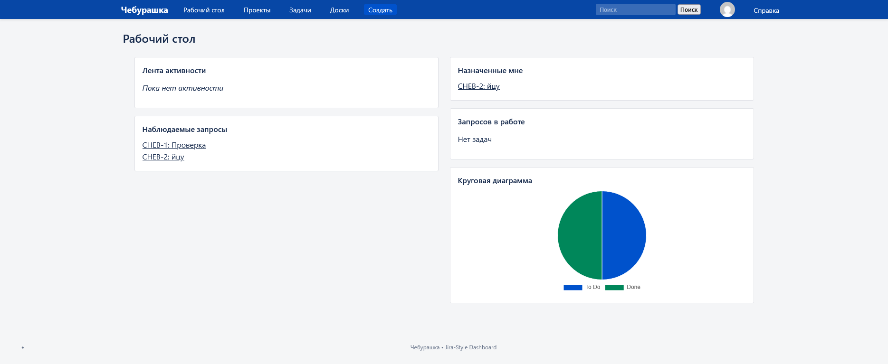
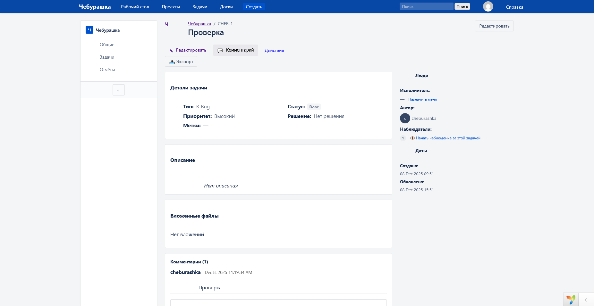

# 🐾 Cheburashka — клон Jira на Yii2 Advanced

Полноценная система управления задачами и проектами, построенная на **Yii2 Advanced**, с разделением на frontend, backend и console. Подходит для командной разработки и расширения под собственные процессы.

---

## 🚀 Установка и запуск

### 1. Установи зависимости

`bash\composer install`

### 2. Настрой базу данных

Создай БД в PostgreSQL:

```sql
CREATE DATABASE cheburashka;
```

Скопируй пример конфигурации:

```bash
cp common/config/db.example.php common/config/db.php
```

Отредактируй `common/config/db.php`:

```php
'username' => 'your_user',
'password' => 'your_pass',
'dsn' => 'pgsql:host=localhost;dbname=cheburashka',
```

### 3. Выполни миграции

```bash
php yii migrate
```

### 4. Запусти сервер

Через XAMPP — положи проект в **htdocs** и открой в браузере.

Или через встроенный PHP‑сервер:

```bash
php -S localhost:8080 -t frontend/web
```

Перейди по адресу: **[http://localhost:8080](http://localhost:8080)**

---

## 📸 Скриншоты



---

## 🗂 Структура проекта

```
common/    — общие модели, компоненты
frontend/  — публичная часть (проекты, задачи, канбан)
backend/   — административная панель (workflow, пользователи)
console/   — миграции, cron-задачи
vendor/    — зависимости Composer
runtime/   — временные файлы
assets/    — ресурсы сборщика ассетов
```

---

## 📄 Лицензия

Проект распространяется под **MIT License**.
См. файл **LICENSE**.

---

> 🚀 *Cheburashka — не просто клон Jira, а основа для собственной гибкой системы управления проектами.*
